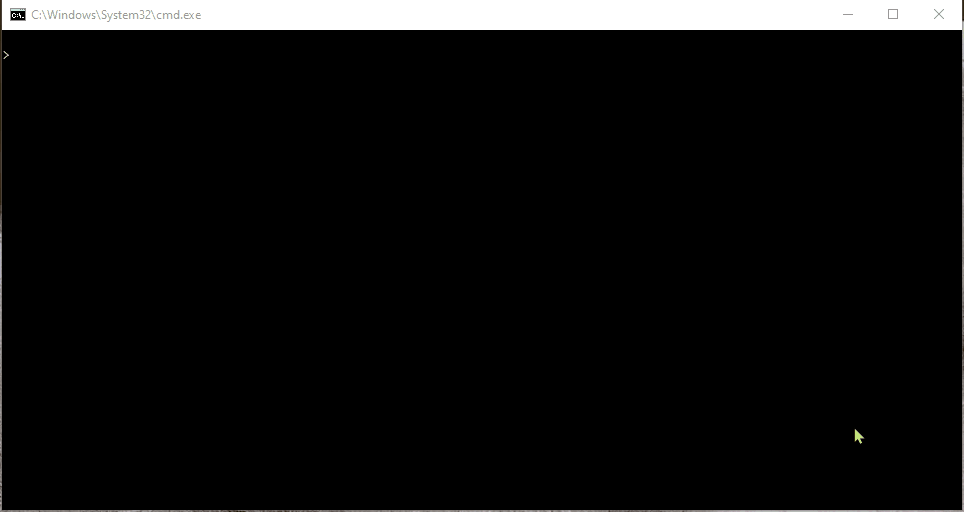
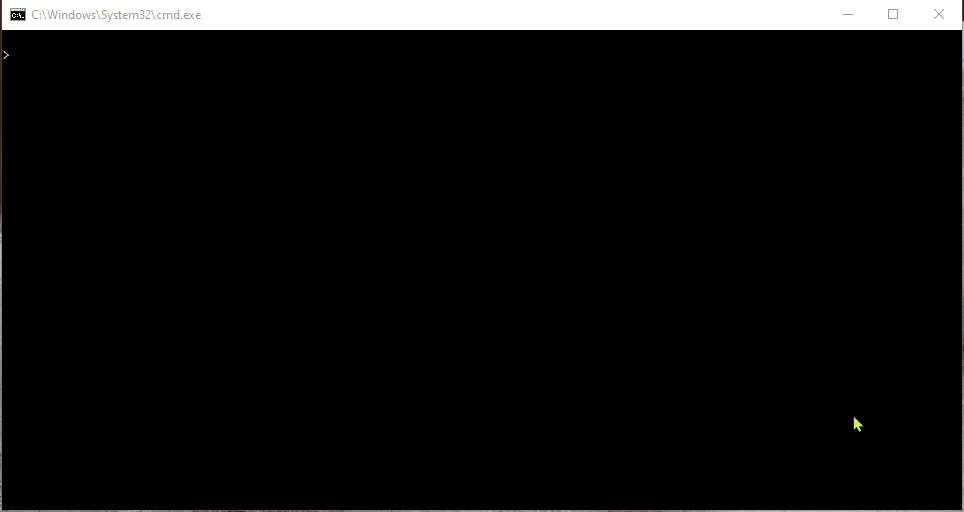
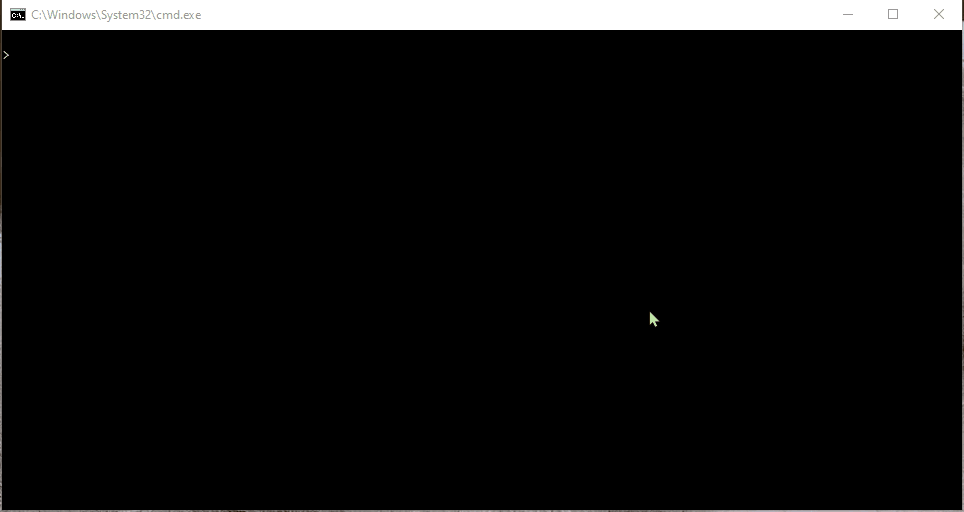
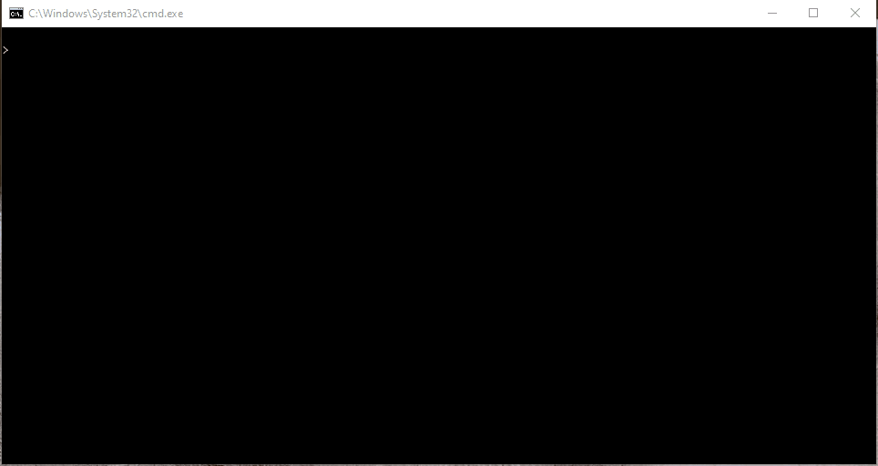

# AI Multi-Agent Search

This is a project about design of adversarial agents for the Pacman. The implementation includes:

* minimax search with alpha-beta pruning
* expectimax search
* improvement of the evaluation function

# Code in Action

This section demonstrates the implemented parts of the code by running the end results.

## Reflex Agent

The following shows the reflex agent that considers both food and ghost locations in order to win the game:

## Minimax Agent

The following shows the minimax agent trying to win the game and evading the adversaries:

## Minimax Agent with Alpha-Beta Pruning

The following shows the minimax agent with alpha-beta pruning trying to win the game and evading the adversaries:

## Expectimax Agent

The following shows the cavalier expectimax agent which makes suboptimal choices by assuming that the adversaries do not always take their best actions:

## Improved Evaluation Function

The following shows how the improved evaluation function helps the Pacman to win the game:

